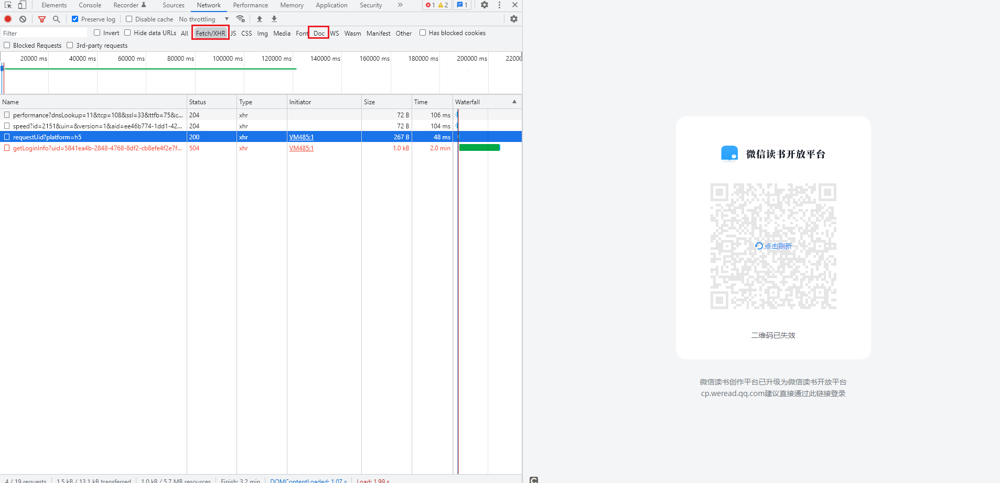
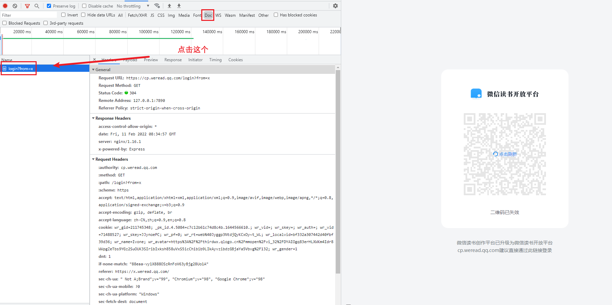
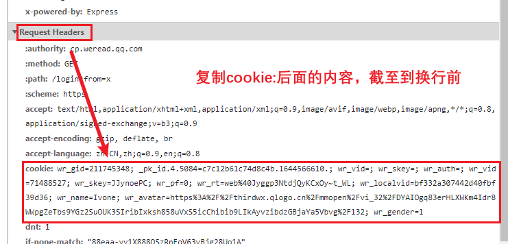

# 微信读书笔记导出到[方寸笔迹](https://fangcun.in)脚本

*感谢@arry-lee的[wereader](https://github.com/arry-lee/wereader)项目*

## 使用方法

### 1️⃣ 第一步，获取我的API

**2月中旬正式开放**，目前正在内测中，如有需要可以联系我

<a href="mailto:ivone@fang-cun.net">ivone@fang-cun.net</a>

### 2️⃣ 第二步，获取微信读书 cookie

*@arry-lee 提供的 `https://x.weread.qq.com/` 目前已经改为 [https://cp.weread.qq.com/login?from=x](https://cp.weread.qq.com/login?from=x)*

用浏览器打开
```http request
https://cp.weread.qq.com/login?from=x
```

然后摁`F12`键打开控制台，并且选择`Doc`或者`FetchXHR`，如下图所示。



保持当前窗口，然后用你的微信扫码登录。

请无视扫码后页面的来回跳转，选择最下方非红色的一条信息，点开。



看到点开内容处，找到`Request Header`中的`Cookie`，复制出来。



### 3️⃣ 第三步，使用脚本

首先Clone本项目到本地，确保本地已经安装Python3和pip3，然后开启命令行，先安装依赖包。

```shell
pip install -r requirements.txt
```

安装完成后，可以直接执行项目入口文件

```shell
python3 run.py
```

按要求输入对应的cookie和API，就可以实现同步了


### 🎉🎉 完成