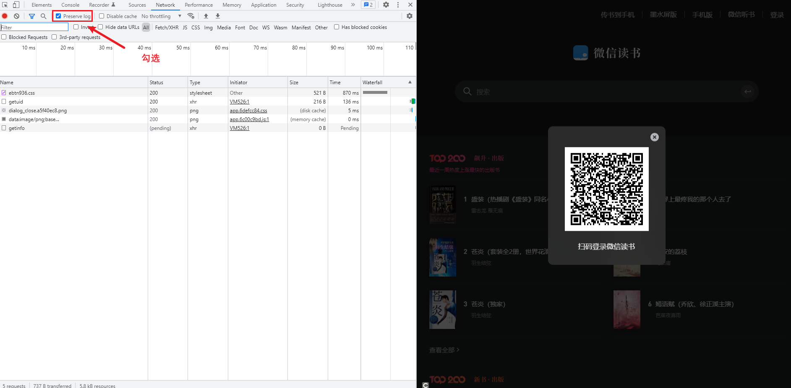
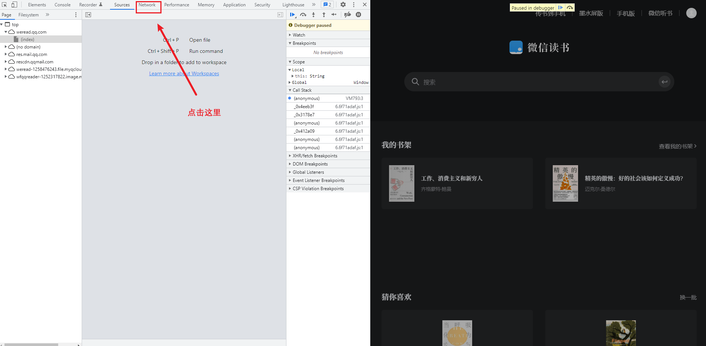
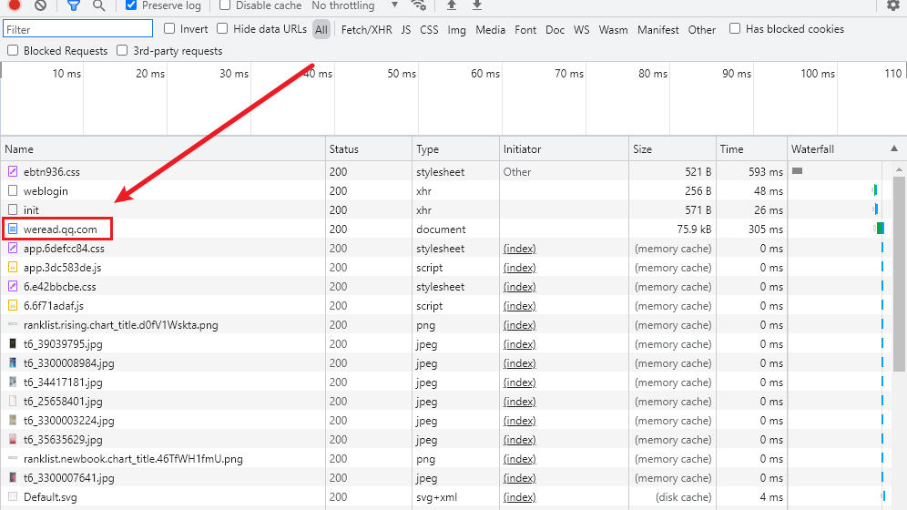
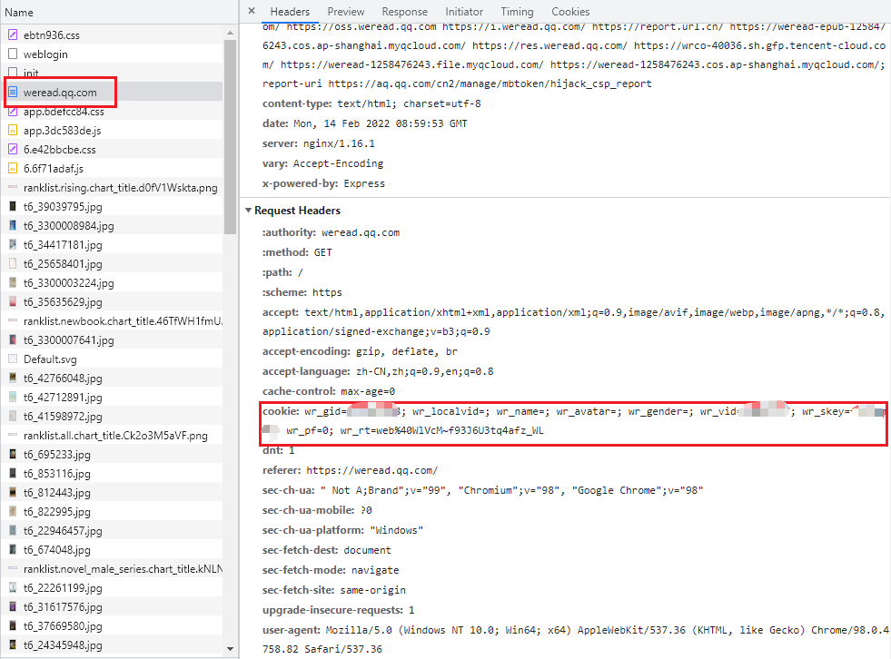
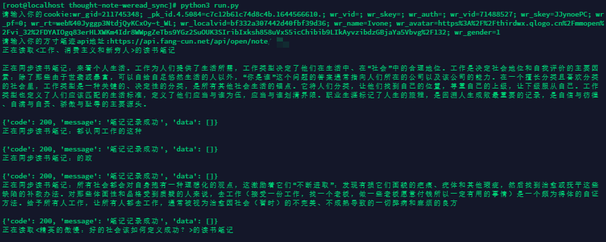

# 微信读书笔记导出到[方寸笔迹](https://fangcun.in)脚本

*感谢@arry-lee的[wereader](https://github.com/arry-lee/wereader)项目*

首先声明，所有数据都是存储到使用脚本者个人本地，不会上传到网络，详细可以阅读代码。
在脚本正常使用后，会在项目根目录中出现`cookie`和`api`两个文件，分别存放着使用脚本时录入的信息。

## 使用方法

### 1️⃣ 第一步，获取我的API

**2月中旬正式开放**，目前正在内测中，如有需要可以联系我

<a href="mailto:ivone@fang-cun.net">ivone@fang-cun.net</a>

### 2️⃣ 第二步，获取微信读书 cookie

*@arry-lee 提供的 `https://x.weread.qq.com/` 目前已经改为 [https://cp.weread.qq.com/login?from=x](https://cp.weread.qq.com/login?from=x) ，部分用户扫码无法拿到有效cookie，以下为新的方式。*

用浏览器打开
```http request
https://weread.qq.com/
```

**如果已经登录网页版微信读书，需要退出重新扫码登录。**

点击右上角的登录按钮， 然后摁`F12`键打开控制台，勾选`Preserve Log`前面的对勾，如下图



保持当前窗口，然后用你的微信扫码登录。

扫码登录后，会出现微信读书程序的暂定，不要慌，这时所需信息已经完整取到了。

进入网络请求信息界面



然后找到`weread.qq.com`并点击,找到`Request Header`中的`Cookie`，复制出来。





*关键信息不方便公开展示，已经打码*

### 3️⃣ 第三步，使用脚本

首先Clone本项目到本地，确保本地已经安装Python3和pip3，然后开启命令行，先安装依赖包。

```shell
pip3 install -r requirements.txt
```

安装完成后，可以直接执行项目入口文件

```shell
python3 run.py
```

按要求输入对应的cookie和API，就可以实现同步了



### 🎉🎉 完成